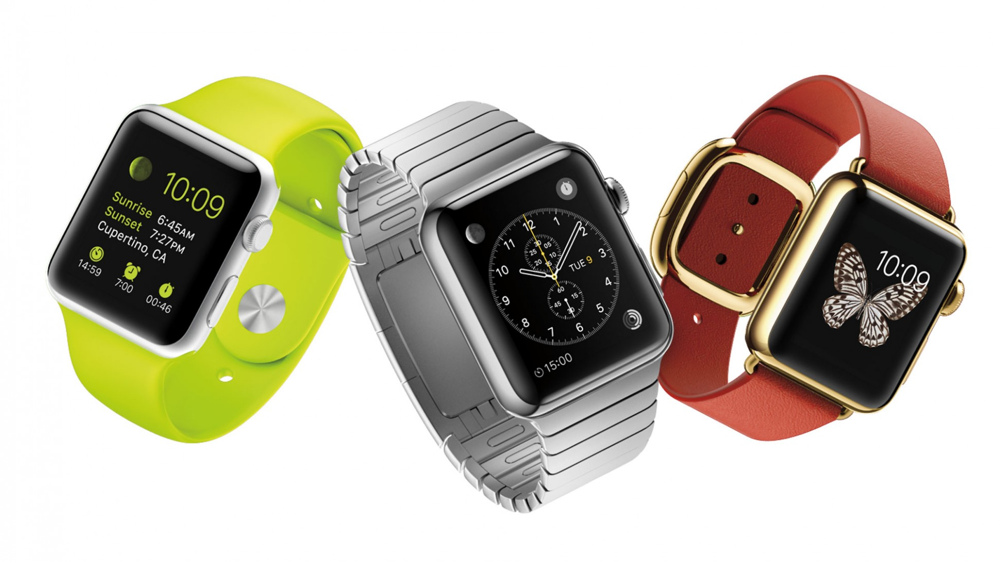

footer: © Benjamin Herzog, 2015
slidenumbers: true

# WatchKit

---

# Apple Watch

---



---

# Apple Watch

- Neue Gerätekategorie für Apple
- Neue Art der Kommunikation
- Neue mobile Apps?!

---

# WatchKit

---

# WatchKit

- Framework von Apple für Apple Watch Apps
- (Sehr) kleiner Bruder von UIKit
- Code läuft auf iPhone!

---


---


---

# WatchKit

- 2 Bestandteile
	- Storyboards und Assets
	- WatchKit-Extension
- Immer nur ein Bestandteil einer iOS-App

^ Extension beinhaltet Code, App nur das Storyboard

---

# WatchKit

- Apple Watch App
- Glances
- Notifications

---

# Apple Watch App

- Wird vom Homescreen bewusst geöffnet
- Relativ freie Funktionsgestaltung
- Zugriff auf alle WKInterface-Elemente
- Mehrere Controller

^ Wechseln zwischen Controllern mit Segue oder Storyboard-Identifier

---

# Glances

- Nur ein einziger Controller
- Keine Action-Elemente (Buttons, Tables etc)
- Kein Scrolling
- Optional

---

# Notifications

- Werden für alle Notifications automatisch erstellt
- Eigene Controller können Extra-Content anzeigen
- Actions müssen im Payload der Notification stehen

---

# Interface Elemente


^ Es fehlen Date und Time-Labels, weil diese absolut unnötig sind. Können nur die aktuelle Zeit anzeigen.

^ Außerdem fehlt die Table, welche statische Elemente dynamisch anzeigen kann.

---

# Das gesamte Interface steht zur Design-Zeit fest.

^ Man kann mit setHeight:, setWidth: und setHidden: noch ein bisschen rumspielen.

^ Nicht zu empfehlen, da Pixelangaben und es gibt 2 verschiedene Modelle.

---

# Kommunikation mit iPhone-App

- Watch

```Swift
var userInfo = ["request": "doSomething"]
WKInterfaceController.openParentApplication(userInfo) { 
	reply, error in
}
```

- iPhone

```Swift
func application(application: UIApplication!,
    handleWatchKitExtensionRequest userInfo: [NSObject : AnyObject]!,
    reply: (([NSObject : AnyObject]!) -> Void)!) {
    
}
```

^ Watch ruft openParentApplication: mit einem Request-Dictionary auf. AppDelegate in der iPhone App empfängt dieses, wertet aus und schickt über einen reply-Handler das Ergebnis zurück.

^ Keine Kommunikation, die von iPhone ausgeht möglich. Kein mehrfaches Aufrufen der reply-Funktion möglich. 

^ Art Server-Client-Kommunikation

---

# Handoff!

^ Handoff ist ein Dienst von Apple, der mehrere Apple-Geräte schnell und unkompliziert miteinander kommunizieren lässt.

^ Nutzer befindet sich in bestimmten Kontext in der App und kann diesen Vorgang an der Stelle an anderem Gerät schnell fortführen.

^ Wenn möglich, Handoff unterstützen, damit der Nutzer schnell am iPhone weitermachen kann.

^ Sehr einfache Implementierung

---

# Besonderheiten in der Implementation

- Animationen funktionieren, aber nur über Einzelframes
- Extension ist Hintergrundtask auf iPhone
- Länger dauernde Requests wie GPS oder Netzwerk immer über iPhone-App machen
- Watch hat 5MB persistenten Speicher

---

# Besonderheiten in der Implementation

- Sehr kurze App-Nutzungsdauer
- Daten können über App Group geteilt werden.
- Code kann über embedded Frameworks geteilt werden
- Im Asset Katalog können unterschiedliche Bilder für beide Modelle angegeben werden

^ (Nur für neue Apps sinnvoll, weil sonst zu großes Refactoring)

^ Interface kann über Size Classes unterschiedlich gestaltet werden.

---

# In welche Richtung sollten Watch Apps gehen?

- Eher eine Art Ergänzung zur iPhone App
- Unterstützung für Notifications
- Schnelle, kurze und relevante Infos

---

# Zusammenfassung

---

# Zusammenfassung

- Watch ist mehr eine Art "verlängertes" Display
- Kein Zugriff auf Sensoren
- Kein Mikrofon- oder Lautsprecherzugriff
- Hoffen auf v2 und native SDK :)

^ Es steckt durchaus sehr viel Potenzial drin!

---

# Diskussion
